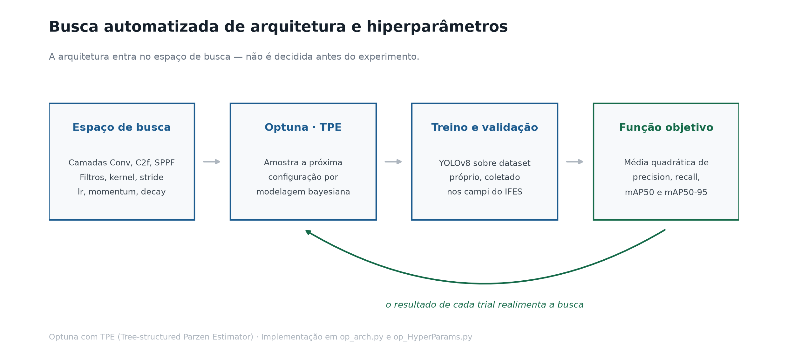
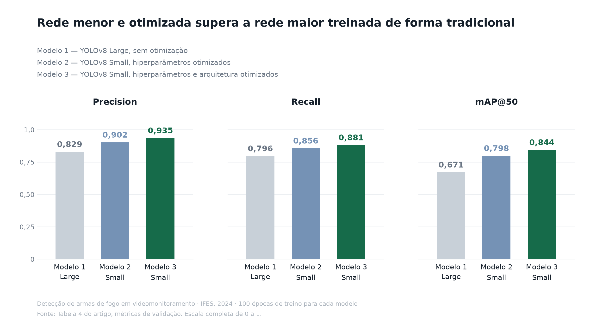
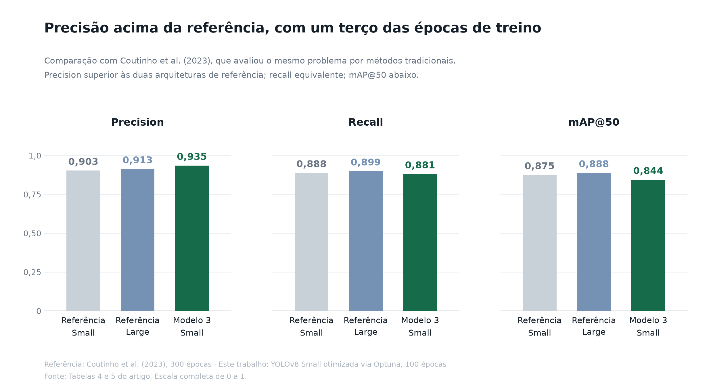

# Detecção de armas de fogo em câmeras de vigilância — YOLOv8 + Optuna

> **[Aprimoramento da Detecção de Armas de Fogo com YOLOv8: Uma Abordagem de
> Otimização de Hiperparâmetros e Arquitetura](artigo.pdf)**
> Leandro Baldan Ferreira — Instituto Federal do Espírito Santo, 2024
>
> 📄 **[Artigo completo em PDF](artigo.pdf)** — método, resultados e discussão

Pesquisa de iniciação científica sobre detecção de armas de fogo em imagens de
videomonitoramento. O objetivo não era só acertar mais: era **acertar mais com
uma rede menor**, viável de rodar perto da câmera, em hardware limitado e em
tempo real.

**O resultado principal:** uma YOLOv8 *Small* com arquitetura e hiperparâmetros
otimizados via Optuna superou uma YOLOv8 *Large* treinada de forma tradicional
em **todas** as métricas avaliadas — precision, recall e mAP@50 — usando um
terço das épocas de treinamento de referência da literatura.

---

## O problema

Câmera de vigilância grava sem parar, mas ninguém assiste a tudo. Detectar
automaticamente uma arma em cena é uma tarefa que o modelo executa sob as piores
condições possíveis: iluminação variável, objeto pequeno no quadro, oclusão
parcial e fundo cheio de distração.

E há a restrição que costuma ser ignorada em pesquisa: um detector que só roda
em GPU de servidor não resolve o problema de quem tem dezenas de câmeras
instaladas. O modelo precisa **caber no hardware que já está no local**. Daí a
pergunta que guiou o trabalho: dá para reduzir a rede sem perder a detecção?

## Método

A hipótese era que a perda de capacidade causada por uma rede menor pode ser
compensada por busca automatizada — desde que a busca cubra a arquitetura, e
não apenas os hiperparâmetros de treino.

Foram treinados três modelos:

| | Arquitetura | O que foi otimizado |
|---|---|---|
| **Modelo 1** | YOLOv8 **Large** | Nada. Treino tradicional, com *data augmentation* |
| **Modelo 2** | YOLOv8 **Small** | Hiperparâmetros de treino, via Optuna |
| **Modelo 3** | YOLOv8 **Small** | Hiperparâmetros **e** arquitetura da *backbone*, via Optuna |

As modificações se concentraram na *backbone*, responsável pela extração de
características — a *head* da YOLO já é projetada para a detecção e
classificação finais.



### Espaço de busca — arquitetura

A cada *trial*, a *backbone* sofria uma de três operações: acrescentar uma
camada, remover a última, ou substituir uma camada existente por outra
configuração. Blocos disponíveis: `Conv`, `C2f` e `SPPF`.

| Parâmetro | Faixa |
|---|---|
| Número de filtros | 16 a 256 |
| Tamanho do kernel | 3 a 18 |
| Stride | 1 a 3 |
| Padding | 1 a 2 |
| Repetições da camada | 1 a 6 |

### Espaço de busca — treinamento

Amostrados em escala logarítmica, que é a escala em que esses parâmetros
efetivamente variam:

| Parâmetro | Faixa |
|---|---|
| `lr0` | 1e-6 a 0.1 |
| `momentum` | 0.1 a 0.99 |
| `weight_decay` | 1e-4 a 0.5 |

O Optuna emprega **TPE** (*Tree-structured Parzen Estimator*), uma abordagem
bayesiana que modela a distribuição dos hiperparâmetros bons contra a dos ruins
e amostra maximizando a razão entre elas — em vez de varrer o espaço às cegas
como busca em grade.

### Função objetivo

O ponto que mais determina o resultado de uma busca automatizada é o que ela
considera "melhor". Otimizar uma métrica isolada produz modelo torto: maximizar
precision entrega um detector que quase nunca dispara; maximizar recall entrega
um que dispara com tudo.

A função objetivo agrega as quatro métricas pela média quadrática:

```python
fitness = ((precision**2 + recall**2 + map50**2 + map5095**2) / 4) ** 0.5
```

Assim, a busca é penalizada por desequilíbrio entre as métricas, e não apenas
por média baixa.

### Dataset

Coletado em ambiente real, nos campi **Guarapari e Vitória do IFES** — não em
base pública de *benchmark*. As imagens vieram das câmeras dos espaços
inteligentes dos dois campi, capturadas dentro de um laboratório de pesquisa em
**diferentes momentos do dia e sob diversas condições de iluminação**,
simulando as condições de um ambiente real de segurança pública.

Rotulação manual de todas as imagens, com caixas delimitadoras sobre as armas.
Divisão de 80% para treino e 20% para validação. O conjunto de Vitória foi
separado em duas partes, com e sem *data augmentation* (rotação, alteração de
brilho e outras transformações) — a parte aumentada treinou o modelo sem
otimização, e a parte sem aumento treinou os modelos otimizados.

## Resultados

Validação dos três modelos, 100 épocas de treinamento cada:

| Modelo | Arquitetura | Precision | Recall | mAP@50 |
|---|---|---|---|---|
| Modelo 1 | Large, tradicional | 0,829 | 0,796 | 0,671 |
| Modelo 2 | Small + HP otimizados | 0,902 | 0,856 | 0,798 |
| **Modelo 3** | **Small + HP e arquitetura otimizados** | **0,935** | **0,881** | **0,844** |



Do Modelo 1 para o Modelo 3: **+10,6 pontos de precision, +8,5 de recall e
+17,3 de mAP@50** — com uma arquitetura *menor*. A otimização não apenas
compensou a redução da rede, ela superou o modelo maior.

### Comparação com a literatura

Coutinho et al. (2023) avaliaram o mesmo problema com métodos tradicionais e
**300 épocas** de treinamento, contra as 100 desta pesquisa:

| Referência | Precision | Recall | mAP@50 |
|---|---|---|---|
| Coutinho et al. — Small | 0,903 | 0,888 | 0,875 |
| Coutinho et al. — Medium | 0,909 | 0,889 | 0,881 |
| Coutinho et al. — Large | 0,913 | 0,899 | 0,888 |
| **Modelo 3 (este trabalho)** | **0,935** | 0,881 | 0,844 |



A **precision de 0,935 do Modelo 3 supera todas as três versões de referência,
incluindo a *Large* (0,913)** — com arquitetura Small e um terço das épocas. O
recall (0,881) ficou muito próximo do Small de referência (0,888). O mAP@50
ficou abaixo (0,844 contra 0,875), diferença compatível com o menor número de
épocas e o foco em arquitetura compacta.

Em detecção de arma de fogo, precision alta tem peso operacional específico:
cada falso positivo é um alarme que consome atenção humana. Um sistema que
dispara errado com frequência é desligado pelo operador — e um sistema
desligado tem recall zero.

### Curvas de treinamento

- A precisão dos Modelos 2 e 3 parte mais alta que a do Modelo 1 desde o início.
  Após ~30 épocas a diferença diminui, mas o Modelo 3 mantém vantagem.
- O Modelo 3 começa com *recall* **inferior** aos demais e os ultrapassa em
  poucas épocas — indício de que a arquitetura otimizada aprende as
  características do problema mais rápido.
- No mAP@50 a ordem é estável do início ao fim: Modelo 3 > Modelo 2 > Modelo 1.

## Experimentos adicionais versionados aqui

Além dos três modelos do artigo, o repositório traz os artefatos completos de
dois treinos sobre **duas coletas distintas do mesmo laboratório de Guarapari**,
feitas em datas diferentes:

| Treino | Coleta | Épocas | Precision | Recall | mAP50 | mAP50-95 |
|---|---|---|---|---|---|---|
| [`Melhor_antigo`](Melhor_antigo/) | primeira | 75 | 98,6% | 97,5% | 98,4% | 75,5% |
| [`Melhor_Novo`](Melhor_Novo/) | posterior | 35 | 78,7% | 75,5% | 78,1% | 55,5% |

Esses dois números **não** formam uma comparação controlada — mudam o dataset e
o número de épocas ao mesmo tempo. Mas a diferença entre eles registra algo que
vale ser dito.

Um modelo com 98,4% de mAP50 parece um problema encerrado. Avaliado sobre
imagens coletadas **no mesmo laboratório, apenas em data posterior**, cai para
78,1%. Não mudou o ambiente. Não mudou o método. Mudou o dado — pequenas
variações acumuladas de iluminação, posicionamento e condição de captura, dentro
da mesma sala.

É *data drift* na forma mais crua, e é a razão pela qual, em visão computacional
aplicada, a pergunta que decide o sucesso não é "qual a acurácia no conjunto de
teste", e sim **quanto essa acurácia cai diante de dado que o modelo nunca viu**.
Métrica de conjunto de teste é o retrato de um instante, não uma promessa de
comportamento em campo.

Curvas e matrizes de confusão de cada treino:

| | Primeira coleta | Coleta posterior |
|---|---|---|
| Curva P×R | [`PR_curve.png`](Melhor_antigo/PR_curve.png) | [`PR_curve.png`](Melhor_Novo/PR_curve.png) |
| Curva F1 | [`F1_curve.png`](Melhor_antigo/F1_curve.png) | [`F1_curve.png`](Melhor_Novo/F1_curve.png) |
| Matriz de confusão | [`confusion_matrix_normalized.png`](Melhor_antigo/confusion_matrix_normalized.png) | [`confusion_matrix_normalized.png`](Melhor_Novo/confusion_matrix_normalized.png) |
| Predições na validação | [`val_batch0_pred.jpg`](Melhor_antigo/val_batch0_pred.jpg) | [`val_batch0_pred.jpg`](Melhor_Novo/val_batch0_pred.jpg) |

## Conclusão

Foi possível desenvolver um detector de armas de fogo **de tamanho reduzido**
com desempenho competitivo — e, em precision, superior — frente a abordagens
tradicionais que usam arquiteturas maiores e o triplo das épocas de treino.

O que viabilizou isso foi tratar a arquitetura como parte do espaço de busca, e
não como decisão fixa tomada antes do experimento. A otimização permitiu que a
versão Small alcançasse valores próximos ou melhores que os das versões maiores.

A relevância prática está no destino do modelo: em segurança pública, o detector
precisa rodar em dispositivo de capacidade limitada, junto à câmera. Modelo
menor significa menos recurso computacional e tempo de resposta mais curto — que
é exatamente o que decide a utilidade do sistema quando a detecção precisa ser
imediata.

## Estrutura do repositório

| Arquivo | Conteúdo |
|---|---|
| [`artigo.pdf`](artigo.pdf) | Artigo completo — método, resultados, discussão e referências |
| `assets/` | Gráficos deste README. Escala completa de 0 a 1, valores das Tabelas 4 e 5 do artigo |
| `op_arch.py` | Busca conjunta de arquitetura e hiperparâmetros. Modifica a *backbone* da YOLOv8 a cada *trial* e exporta o YAML resultante |
| `op_HyperParams.py` | Busca apenas de hiperparâmetros, a partir de um *checkpoint* treinado. Persiste os *trials* em `trials.txt` para retomar o estudo entre execuções |
| `dados.yaml` / `dados2.yaml` | Arquiteturas resultantes da busca, no formato de modelo da Ultralytics |
| `new_convs.yaml` | Variante experimental com *backbone* ResNet50 |
| `Melhor_antigo/` | Artefatos completos do treino sobre a primeira coleta de Guarapari |
| `Melhor_Novo/` | Artefatos completos do treino sobre a coleta posterior |

Cada pasta de resultado traz `results.csv` com o histórico de métricas por
época, `args.yaml` com a configuração exata do treino, as curvas de avaliação e
os *batches* de treino e validação com as predições desenhadas.

## Stack

Python · [Ultralytics YOLOv8](https://github.com/ultralytics/ultralytics) ·
[Optuna](https://optuna.org/) · PyTorch

## Como reproduzir

```bash
pip install ultralytics optuna optunahub
```

Os scripts usam caminhos absolutos da máquina de desenvolvimento. Ajuste as
constantes no topo de `op_arch.py` e `op_HyperParams.py` para apontar ao seu
dataset no formato da Ultralytics e ao *checkpoint* de partida:

```python
CAMIN  = "caminho/para/seu/dataset.yaml"
MODEL5 = "caminho/para/checkpoint/best.pt"
```

Depois:

```bash
python op_arch.py         # busca de arquitetura + hiperparâmetros
python op_HyperParams.py  # busca só de hiperparâmetros, retomando trials.txt
```

## Limites conhecidos

- **A redução de tamanho não está medida em número.** A diferença entre as
  arquiteturas Large e Small é conhecida, mas não há contagem de parâmetros nem
  tempo de inferência medidos e versionados aqui. O ganho de eficiência é
  sustentado pela classe de arquitetura, não por *benchmark* próprio.
- O Modelo 1 foi treinado com *data augmentation* e os Modelos 2 e 3 sem —
  a comparação entre eles carrega essa diferença de tratamento do dado.
- Os treinos em `Melhor_antigo/` e `Melhor_Novo/` usam datasets e número de
  épocas diferentes; documentam dois experimentos, não um A/B controlado.
- Os scripts carregam caminhos absolutos, e `op_HyperParams.py` exige que
  `trials.txt` exista antes da primeira execução.
- O dataset foi coletado no IFES e não é redistribuído aqui.

## Referência principal de comparação

Coutinho, L.; Soprani, D.; Canuto, C.; do Carmo, A.; Amigo, B.; Rampinelli, M.;
Ribeiro, R.; Pereira, R. **Videomonitoramento em Espaços Inteligentes: Uma
Aplicação de Segurança Pública em Identificação de Armas de Fogo.** Instituto
Federal do Espírito Santo, Campus Guarapari, 2022.
